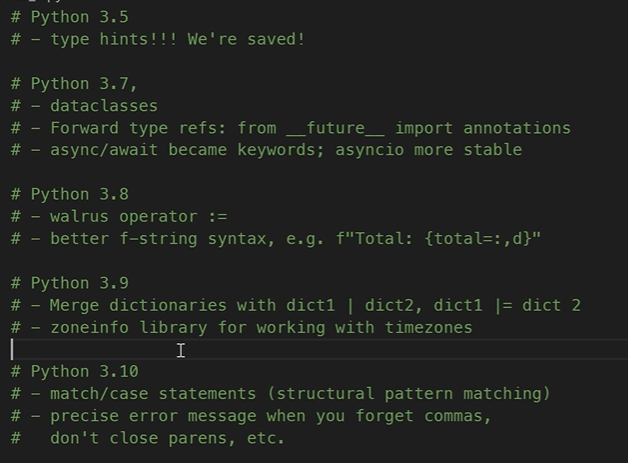

### 1. SEMANTIC VERSIONING 

**MAJOR.MINOR.PATCH** 

* **MAJOR** -> breaking change 
* **MINOR** -> Adding new functionality, feature, and backward compatible. 
* **PATCH** -> just a bug fix.

Official documentation for the semantic version: [click](https://semver.org/)


### [Managing Python environemnt](https://ericriddoch.notion.site/Resources-for-installing-pyenv-1cd45005cc6a4eef906f5165f259db94)


### Notes; 
* When-ever if you are specifying the pacakges in python, you should consider specifying by the package with **semantic versoning**. 
* This is because if you are specifying the package normally like `pip install numpy` sometimes they will upgrade the package that may contians some breakable change, that will affect your whole code. So instead you can specify like this `pip install numpy<3.0.2`, it will make sure it don't affect any of your exisiting package in your application or you can also mention like this `pip install numpy==3.2.0`. 
* The only drawback of this your package won't upgrade until you're upgrading manually. depends on the situation decide what you can use. 


#### Specify the version properly 

##### **0.0.0**

* If you're specifying the semantic version `0.0.0` client may think like your application in "alpha" or "unstable" phase. It's for getting feedback from the people. It can also communicate "this package can break anytime", so use with caution. 
* It's not generalized, it's published only for the feedback or showcasing. People don't consider your package is stable. 


##### **Deprecation warning** 

* Deprecation is whenever you remove an existing functionality or peice of existing API. 
* So whenver you're going to remove anything you should give the **Deprecation** warning for long time before removing that changes. That's the nicest way of removing anything from your code. Let's say you're going to remove a major API call to something give a warning 3 months back, so your'e users will get to know they will remove this feature in the future version. 
* Mostly people do this kind of changes in the **MAJOR** version. 

    ```python 
    ## you can do this warning by importing the warn package

    from warning import warn 
    warn("This will be removed on the future version", DeprecationWarning, )  ## advanced strategy :) 

    ```


### 2. Managing multiple versions in python 

#### 2.1: Why we are working with multiple python version? 
* Sometimes if you're working with team, you will end up with downloading multiple version of the python. Definetly this will cause problem. Let's see how to download the python in differnet way. 
* Most of the time, python imporoves it's version very frequently so because of this developers download new version to the machine, sometimes it may cause problem. 
* MOst of the cases new python version does not compatible with lot of modules like "numpy", "matplotlib", "pytorch". So developers have to keep a eye contact on installing the new python versions. 

#### 2.2 [Installing python](https://xkcd.com/1987/)
* There are lot of ways to install python, you can check this meme to understand [click](https://xkcd.com/1987/) but in last few years our communitity standartized a general way of downloading python by using the `pyenv`. 
* **PYENV** is a CLI tool that is used for installing different python version and switching between them. 

#### 2.3 [**Installing pyenv**](https://github.com/pyenv/pyenv) 
```python 

## run this (1)
curl https://pyenv.run | bash 

# and paste this in ./zshrc at last  (2)
export PYENV_ROOT="$HOME/.pyenv"
export PATH="$PYENV_ROOT/bin:$PATH"
eval "$(pyenv init --path)"
```

#### 2.4 pyenv commands 
```python 
#installing new python 
pyenv install <python-version>

#list all the versions available to switch
pyenv versions 

#change the python version 
pyenv shell <python-version-from-previous-command> 
##-- last command only changes to the particular shell, if you want to change to globasl use the bellow command 

pyenv global <python-version>
```

### 3. Python History: 




### New term: 
* LTS -> LONG TERM SUPPORT 